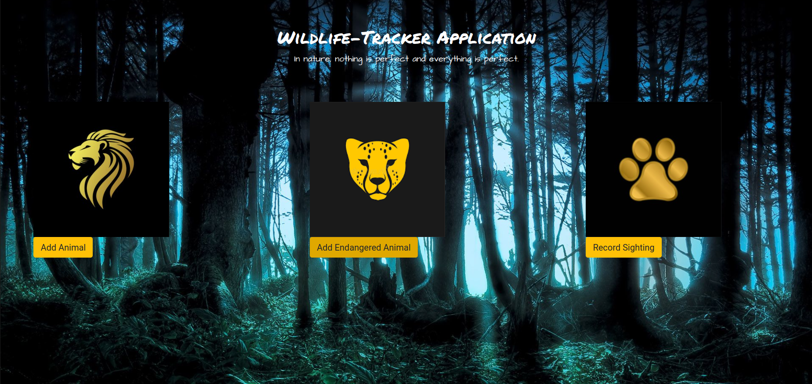

# Wildlife-Tracker
* This is a website for Wildlife tracking services.

## Description
* This is a wildlife-tracking application that allows a ranger to keep track of sightings and also number of endangered animals.
#### Author: **EDWIN MURIITHI**

## Getting Started
## Installation
* `git clone <https://github.com/edwinmuriithi/WildlifeTraker.git>` this repository
* `cd WildlifeTracker`

## Live Demo
To view the page click on the link below
[https://wildlife-tracker-site.herokuapp.com/](*)

### Setup Requirements for Production Database
1.Launch postgres

2.Type in psql

Run these commands

3. CREATE DATABASE wildlife_tracker;

4. \c wildlife_tracker;

5. CREATE TABLE animals (id serial PRIMARY KEY, name varchar, health varchar, age varchar, type varchar);

6. CREATE TABLE sightings (id serial PRIMARY KEY, animal_id int, location varchar, ranger_name varchar, timestamp timestamp);

7. CREATE DATABASE wildlife_tracker_test WITH TEMPLATE wildlife_tracker;

## Functional Requirements
The application allows the user to:

1.Add a new animal
 
2.Add an endangered animal

3.Record an animal Sighting

## Technologies Used
* Java
* Handlebars
* Spark 
* Gradle 
* HTML & CSS

## Contact Information
* Edwin Muriithi - kabuimuriithi@gmail.com

## Version History
* 0.2 Addition of various Styles and Features
* Initial Commit

## Licence
* Distributed under the MIT License. See LICENSE for more information.

## Acknowledgements
* Technical Mentor
* Heroku Deployment
* Github